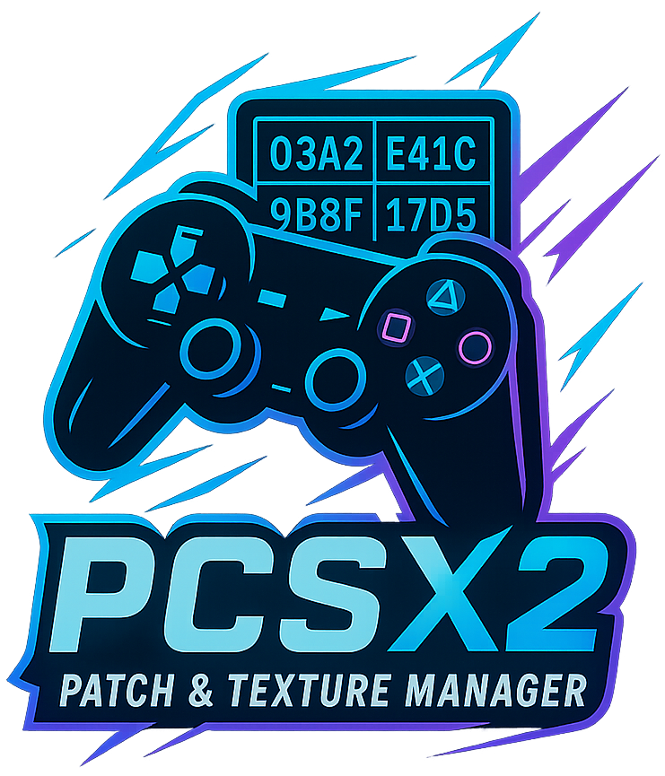
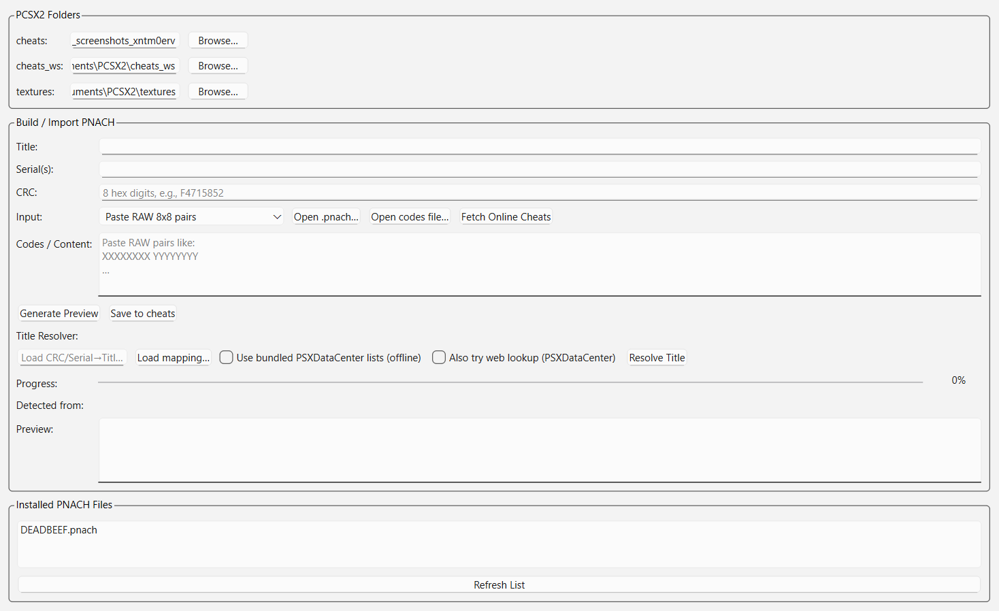
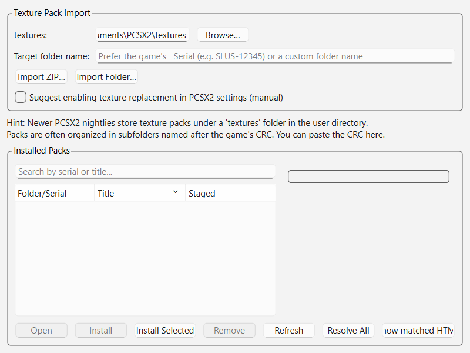
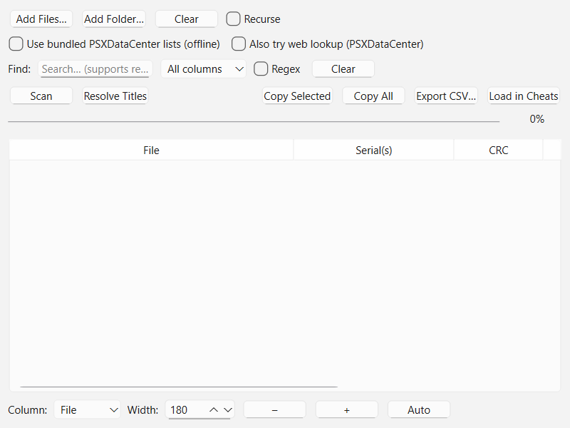

<p align="center">
	
</p>

# PCSX2 Patch & Texture Manager — Beta

Lightweight GUI tool to help create, import, preview and install PCSX2 `.pnach` patches and texture packs.

Version: beta

## Summary

This project provides a Qt-based desktop application (PySide6) for working with PCSX2 patch files (`.pnach`) and texture replacement packs. It includes:

- RAW ↔ PNACH conversion and previewing
- Auto-detection and resolution of Serial/CRC values (local mapping + optional online PSXDataCenter lookup)
- Fetching and importing online cheats (GameHacking.org, forums, optional Playwright rendering)
- Drag & drop support for `.pnach`, `.zip` and folders
- Texture pack import/installation with automatic CRC suggestions
- Simple INI toggles and test launch for PCSX2
- Per-game profile export/import (JSON)

## Current implementation / features

- GUI application entrypoint: `main.py` (Qt/PySide6)
- Title resolver using local bundled PSXDataCenter HTML files (`ulist2.html`, `plist2.html`, `jlist2.html`) and optional online lookup
- Online cheat fetching via `cheat_online.py`; Playwright-based renderer available in `playwright_fetch.py` (optional)
- Helpers for parsing and building PNACH files: `parse_pnach_text`, `parse_raw_8x8`, `build_pnach`
- Thumbnail/cover fetching for installed packs (caches under the user's home directory)

## Screenshots / Logo

The repository includes `logo.png` which is used as the application icon and is shown above.

### Screenshots (real)

The following screenshots were captured from a running instance of the application and are included in `screenshots/`:

| Cheats (.pnach) | Textures | Bulk Scanner |
|---:|:---:|:---|
|  |  |  |

## Requirements

- Python 3.10+ recommended
- PySide6
- beautifulsoup4
- requests (optional but recommended for online features)
- playwright (optional; only required when using the Playwright renderer; follow Playwright docs to install browsers)

To make installation easier a minimal `requirements.txt` is included.

## Installing (Windows PowerShell)

1. Create and activate a virtual environment (recommended):

```powershell
python -m venv .venv
.\.venv\Scripts\Activate.ps1
```

2. Install dependencies:

```powershell
pip install -r requirements.txt
```

3. (Optional) If you plan to use Playwright-based fetching, install browsers:

```powershell
pip install playwright
python -m playwright install
```

## Running the GUI

From the repository root (PowerShell):

```powershell
python main.py
```

This launches the Qt GUI. The app will look for `logo.png` in the repo root for the window icon.

## CLI / Tests

- Quick dependency checks are provided by `check_deps.py` and `check_pyside_import.py`.
- Unit tests live under `tests/` and can be run with pytest (if installed):

```powershell
pip install pytest
pytest -q
```

## Notes & Troubleshooting

- If the GUI fails to start, ensure `PySide6` is installed and compatible with your Python version.
- Online features gracefully degrade: if `requests` or `playwright` are missing, the app still runs for local/offline work.
- The app tries to auto-detect common PCSX2 user directories. You can set the base path manually in Settings.

## Contributing

Please see `CONTRIBUTING.md` for developer notes, testing guidance and how to contribute.

## License

This project is licensed under the [MIT License](LICENSE).

---

If you'd like further improvements (stricter CI or expanded developer docs), I can add them.
Please see `CONTRIBUTING.md` for developer notes, testing guidance and how to contribute.
