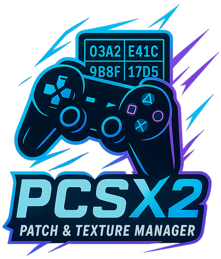

<p align="center">
	
</p>

# PCSX2 Manager — Beta

A library-first desktop tool: point it at your PS2 games folder, then pick a game and install its matching cheats and texture pack with one click.

Version: beta

## Summary

This project provides a Qt-based desktop application (PySide6) built around your game library rather than manual browsing. It includes:

- **Library scan**: point it at a folder of PS2 disc images (`.iso`/`.bin`/`.chd`/`.cso`) and it detects each game's serial/title from the filename. Games that aren't picked up automatically can be added manually by serial.
- **One-click sync**: select a game and click "Sync This Game" to install its cheats (from a bundled offline database, falling back to online sources) and its texture pack (from a small curated GitHub-repo index), always matched to that game's exact region/serial.
- **Custom window chrome**: a frameless, dark-themed title bar instead of the native OS chrome.
- **Advanced tools** (title bar menu): the original manual `.pnach` editor (RAW ↔ PNACH conversion/preview, raw code parsing, online cheat search) and texture pack manager (drag & drop `.zip`/folder install, staging) are still there for power users, just tucked out of the primary flow.
- **Settings** (gear icon): PCSX2 folder detection/override, INI toggles, quick launch, game profiles.

## Current implementation / features

- GUI application entrypoint: `main.py` (Qt/PySide6)
- `LibraryView`: folder scan (`GameScanWorker`), manual add, and sync orchestration reusing the existing cheat/texture install pipelines
- Local cheats database (`ps2_cheats_database_merged.json`) loaded once and shared across the app; online fallback via `cheat_online.py` (GameHacking.org, PSXDataCenter)
- Curated texture-pack manifest (`texture_sources.json`, hand-verified GitHub repos) resolved through GitHub's public releases API; installed via `textures_install.py`
- Title resolver using local bundled PSXDataCenter HTML files (`ulist2.html`, `plist2.html`, `jlist2.html`) and optional online lookup
- Helpers for parsing and building PNACH files: `parse_pnach_text`, `parse_raw_8x8`, `build_pnach`
- Thumbnail/cover fetching for installed packs (caches under the user's home directory)

## Requirements

- Python 3.10+ recommended
- PySide6
- beautifulsoup4
- requests (optional but recommended for online features)

To make installation easier a minimal `requirements.txt` is included.

## Installing (Windows PowerShell)

1. Create and activate a virtual environment (recommended):

```powershell
python -m venv .venv
.\.venv\Scripts\Activate.ps1
```

2. Install dependencies:

```powershell
pip install -r requirements.txt
```

## Running the GUI

From the repository root (PowerShell):

```powershell
python main.py
```

This launches the Qt GUI. The app will look for `logo.png` in the repo root for the window icon.

## CLI / Tests

- Quick dependency checks are provided by `check_deps.py` and `check_pyside_import.py`.
- Unit tests live under `tests/` and can be run with pytest (if installed):

```powershell
pip install pytest
pytest -q
```

## Notes & Troubleshooting

- If the GUI fails to start, ensure `PySide6` is installed and compatible with your Python version.
- Online features gracefully degrade: if `requests` is missing, the app still runs for local/offline work.
- The app tries to auto-detect common PCSX2 user directories. You can set the base path manually in Settings.

## Contributing

Please see `CONTRIBUTING.md` for developer notes, testing guidance and how to contribute.

## License

This project is licensed under the [MIT License](LICENSE).


